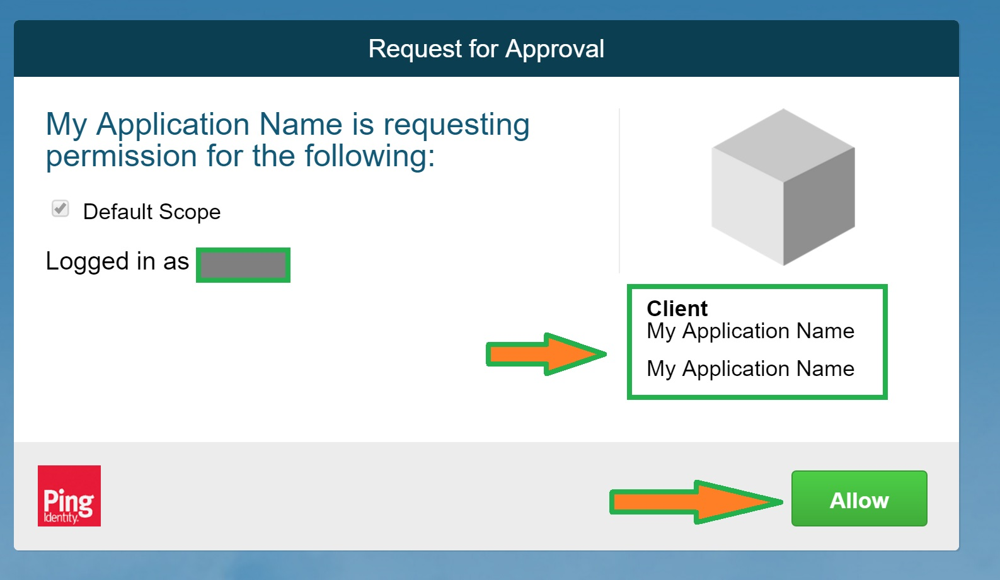
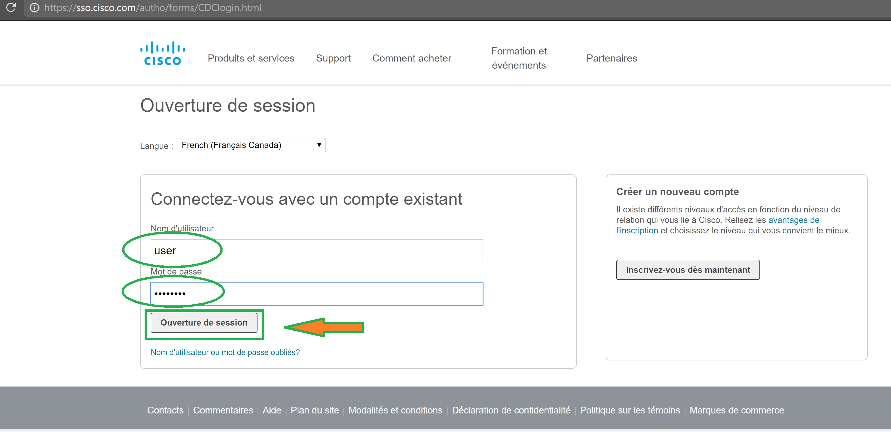

##  Get Token athentication
<H5>You are now able to get a token ! </H5>

Try to access with your favorite browser the following URL
After replacing your own Client ID value in the 'client_id' field.
To work properly following conditions are mandatory:
- **redirect_uri**: must be the same value than the one defined in your MuleSoft application
- **client_id**: must be the client ID defined in your MuleSoft application

```
https://cloudsso.cisco.com/as/authorization.oauth2?response_type=token&redirect_uri=http://localhost/My_ITK_Application/index.html&client_id='replace_with_your_own_Client_ID'

```
After allowing the use of your application by pressing the '**ALLOW**' button
(this steps needs to be performed only once):
<br/><br/>


You will need to authenticate with **CISCO CEC login** and password
(this steps also needs to be done to renew your token after expiration time)
  <br/><br/>


The token is given by within the redirect URI itself:
```
http://localhost/My_ITK_Application/index.html
#access_token=NbKQulb7foxokWq3GIgULZwj3UHd&token_type=Bearer&expires_in=3599

```


We will see later that an HTML5 application can be parse this URL in order to extract the token value.
But for our next exercise, we will use Postman, so you just need copy the token value from 'access_token' field of this URL.
Note the token has an expiration date of 1 hour.
This value can be changed in the settings of your application.


```json
TIP:
If you are not able to get the token with redirect URI.
It's probably because some application parameters are not correct.
Use next step to check the application configuration.

```

##  Get Token without redirect uri

It's also possible to get a Token using a **POST** request, 
by setting **grant_type** to '**client_credentials**'

Retrieve an access token for the Prod portal
Example with CURL :

`curl -X POST -H "Content-Type: application/x-www-form-urlencoded" -d "client_id=XXXXXX&client_secret=YYYYYY&grant_type=client_credentials" https://cloudsso.cisco.com/as/token.oauth2
`

Example with a POST command with Postman
> https://cloudsso.cisco.com/as/token.oauth2?grant_type=client_credentials&client_id=XXXXXX&client_secret=YYYYYY

Example with a piece of JavaScript code:

        rest.post("https://cloudsso.cisco.com/as/token.oauth2", {
            data: {
                "client_id": XXXXXX,
                "client_secret": YYYYYY,
                "grant_type": "client_credentials"
        }}).on("success", function(token, response){
            token.client_id = clientId;
            sendJSONresponse(res, 200, token);
        }).on("fail", function(error, response){
            sendJSONresponse(res, response.statusCode, error);
        });
    },


Response :
`{ "access_token": "zzzzzz", "token_type": "Bearer", "expires_in": 3599 }
`

```
You need to replace:
- XXXXXX by your own Client ID
- YYYYYY by your own Client Secret

```