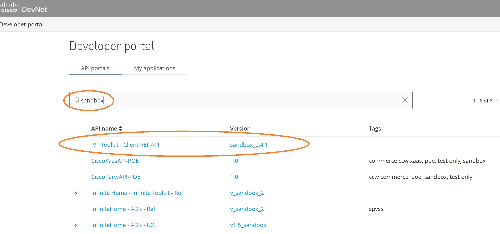
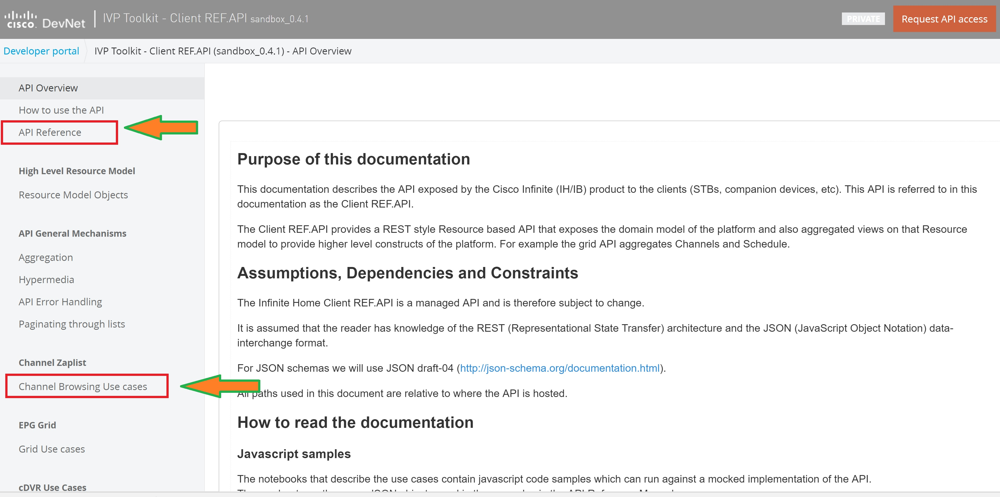
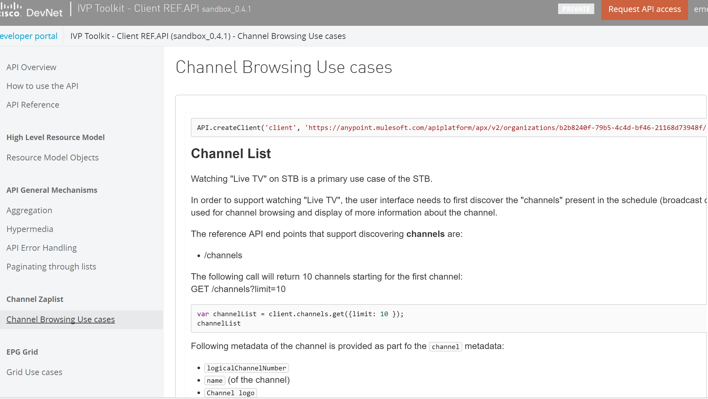
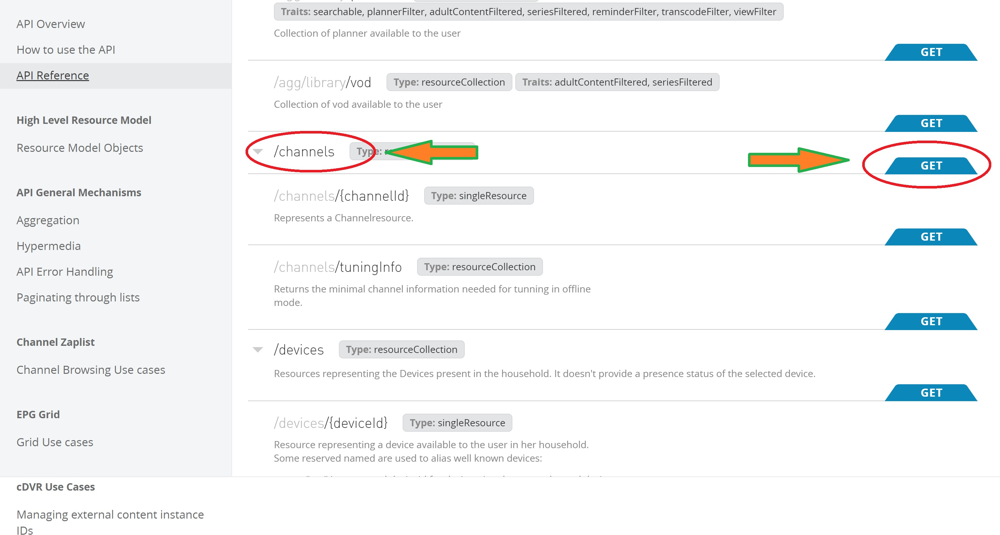
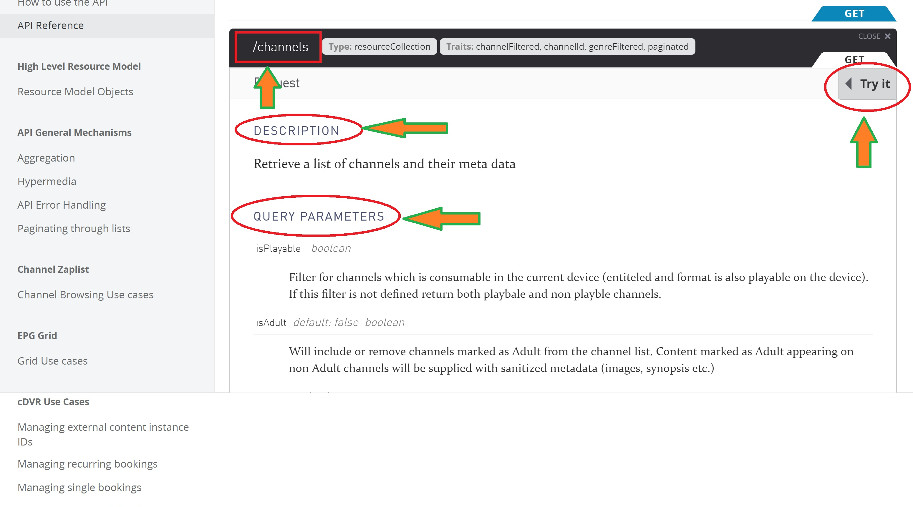

#  How to play video content with REF-API (2/7)


```json
**IMPORTANT**: There are always 2 steps before playing a video contznt,
1. **find the event**
2. **create a play session**
```


#2 Sanbox API

Sandbox list is available here: https://anypoint.mulesoft.com/apiplatform/apx/#/portals
By using the keyword 'sandbox', you can find the latest version available:
  <br/>


On  the left side of the main page, information about main features provided by the sandbox are available.
For this lab, please read **Channel Browsing Use cases** section first,
then go to **API Reference** section where all API and query parameters are explained.

  <br/>

In the **Channel Browsing Use cases** section, basic cases of /channel command are given,
  <br/>


In the **API Reference** section, find the */channels* endpoint, then Press the 'GET' button,
  <br/>


In the ** /channels ** section, user will find:
- API name
- a short descfiption
- The list of Query Parameters supported by this API.
- A 'TRY IT' button in order to experiment this request.
- Error codes supported.
- Example of standard answer.


  <br/>
