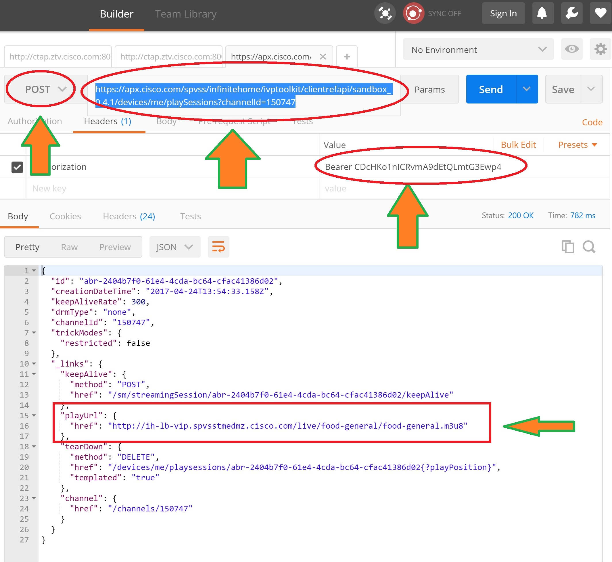

#  How to play video content with REF-API (4/7)


#5 Create Play Session

To create a playSession for a specific content, the client needs to do the following:

1. Obtain the **playSession hyperlink** of the content to be played.
2. **POST playSession** hyperlink, optionally providing playPosition in the query to create the session. The response will include the playUrl hyperlink, tearDown hyperlink and keepAlive hyperlink.
For transcoded content streaming, transcodeProfile must be provided.


Optionally for transcoded content streaming, the audioLanguages and subtitleLanguages to be provided in the output stream can also be chosen.


Once the client has created the playSession, it can start retrieving the streaming data using the playUrl.
Trick modes are client based. Hence a client needs to use the underlying transport mechanisms to do trick modes.

**Example**:
To obtain the playable URL at HLS format corresponding to channel ID 150747,
Use the following command on POSTMAN in **POST** mode.
> https://apx.cisco.com/spvss/infinitehome/ivptoolkit/clientrefapi/sandbox_0.4.1/devices/me/playSessions?channelId=150747
>


  <br/>


The playable URL will be found in JSON answer under:
> **"_links":**
>     "playUrl": {
      "href": "http://ih-lb-vip.spvsstmedmz.cisco.com/live/food-general/food-general.m3u8"
    }
    We will see in next section how to playback such HLS streamed content.
    (HLS = Http Live Stream)


</br>
```json
TIP:
The REF-API provide various type of video content:
- Live TV channel
- VOD assets (VOD = Video on Demand)
- CDVR records (CDVR= Cloud Digital Video Recorder)
```

### Session Keep Alive

The client is responsible to keep the session alive during the playback of the content.
The playSession provides the information to ping the server by supplying the frequency for performing the keepAlive and the hyperlink URL which the POST method is to be invoked on. This hyperlink is not templated.


### Delete session

When the client finishes consuming from the session, it shall delete the 'playSession'.
The delete session also provides a mechanism to store/update the lastPlayPosition in the contentInstance by allowing the client to pass an optional parameter playPosition.


### PlaySession information

Last Played Position Management
The client has access to the last played position of a given content. It represents the viewing time from the start of the content that has been stored in the system.


### Session failure

The server checks if a playSession is allowed to play e.g. the server checks if all policies are met to allow playback on the device (e.g. client). This check is performed at creation time of the  playSession.
There are different conditions under which creation of the playSession may fail.
When the playSession is not created due to policies an HTTP 403 error is returned with additional payload describing the error reason.

The error codes and descriptions are available in REF-API specification.

You now have a first experience about which kind of information is provided by the REF API :
- asset
- live channel
- metadata
- play session

It's time to use your first application displaying these information.