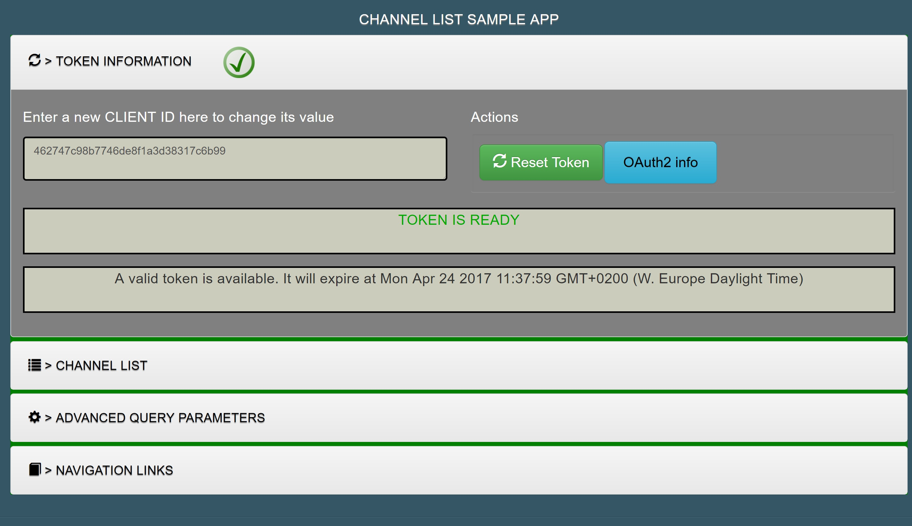
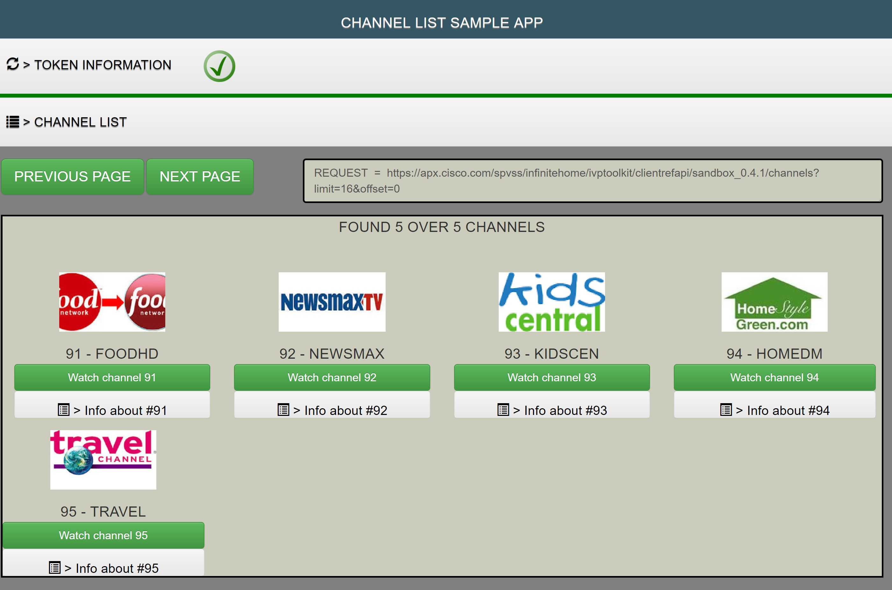

#  How to play video content with REF-API (5/7)


#5 -   Sample app to display "channels" answer

#5.1 Multi devices application

The REF-API is returning JSON anwsers that can be managed and displayed on various devices with various implementation:
- **HTML5 / Javascript** application running on all browsers 
- **Angular** application
- **Android** application running on Amazon Fire or Nexus Player, ...
- **IOS** application running on all Mac devices (IPad, IPhone, Mac, ...)


As we want to cover a maximum number of devices with our first implementation,
let start with a HTML5 browser which can be easily run on companion devices, Laptops, PC or STBs.
Here is how can we display the metadata of the channel list with an HTML5 / Javascript application.


Source code can be found here:


Following features are used on our sample application and need some explanations:
- **Bootstrap** for progressive design (adaptation to screen device)
- **Accordion** to focus on active part of the application
- **CORS** contraints for Cross domain compatibility on HTML5 browsers


#5.1 Bootstrap

Bootstrap is providing CSS, HTML and Javascript framework allowing a powerful responsive design that adjusts to desktops, tablets and mobiles screen display.
  <br/>

Many presentations of Bootstrap responsive design can be found on the Web, here are some links:
> https://www.sitepoint.com/responsive-web-design-tips-bootstrap-css/
> http://getbootstrap.com/2.3.2/scaffolding.html


#5.2 Accordion

Accordion is a convenient way to open / close panels.
It really fit to multi-device implementation because it allows to focus on active part of the application.
This feature is natively included in Bootstrap package.

Our sample app is managing 4 panels:

  - **first panel** is dedicated to token status (
it will be automatically opened in case of authnetication issue.
But it can also be opened manually to get information about token expiration time.
  <br/>

  - **second pannel **is dedicated to channel information
  <br/>

  - **third pannel** is dedicated to advanced query parameters and provide an area to read the JSON answer
  <br/>

  - **fourth pannel** is dedicated to navigation links
  <br/>


#5.3 CORS


Cross-Origin Resource Sharing (CORS) is a specification that allows cross-domain communication from the browser. By building on top of the XMLHttpRequest object, CORS allows client application accessing domain requests different than the base URL.

Preflight answer requests to have information about *Access-Control-Allow-Origin* in its header:
**Access-Control-Allow-Origin** - This header must be included in all valid CORS responses; omitting the header will cause the CORS request to fail. The value of the header can be:
- a list of domains authorized to send requests 
- or be a ** * to allow requests from any origin.


</br>

  <br/>


Please find detailed information about CORS on this following link:
> https://en.wikipedia.org/wiki/Cross-origin_resource_sharing
>

</br>
```json
Warning:
The CORS issues are server side located.
If the expected CORS information  **Access-Control-Allow-Origin**  isn't found
in the header, client application can't workaround it.```


