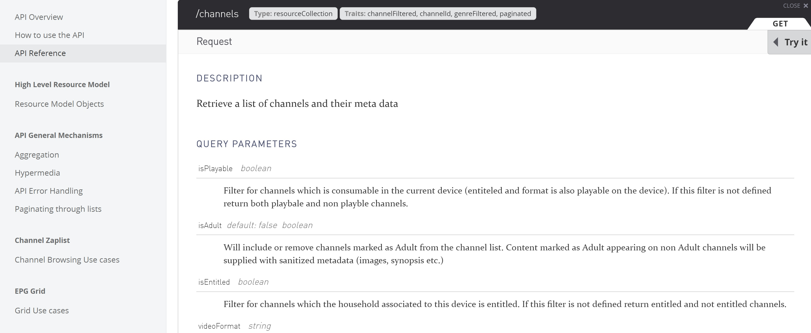
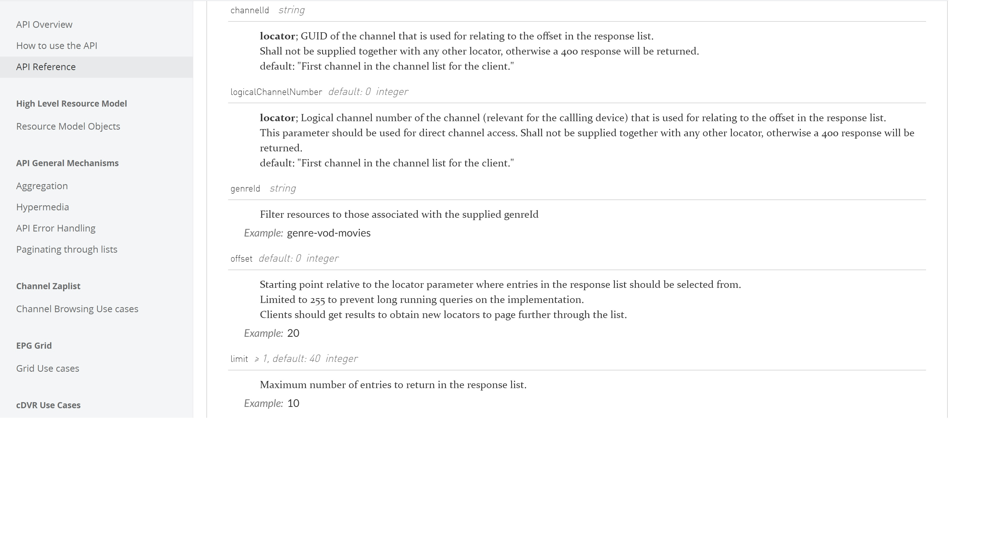

#  How to play video content with REF-API (7/8)

## 7 Use advanced query parameters

### Select advanced query
Open '**Advanced Query Parameters**" panel by clicking on corresponding tab.

   

As /channels API is simple, only 2 parameters can be applied:
- **offset**: to change set the first element of the answer
- **limit**: to set the number of elements of the answer

Once indicating numerical values in these 2 fields,
press '**SUBMIT REQUEST**' button to perform the query.

The JSON answer can be turned visible or hidden by pressing the **JSON Preview **toggle button.

### Get query parameters list from REF-API specification

  
  

**Warning:**

> **offset** parameter is limited to 255 to prevent long running queries on the implementation.
> 
