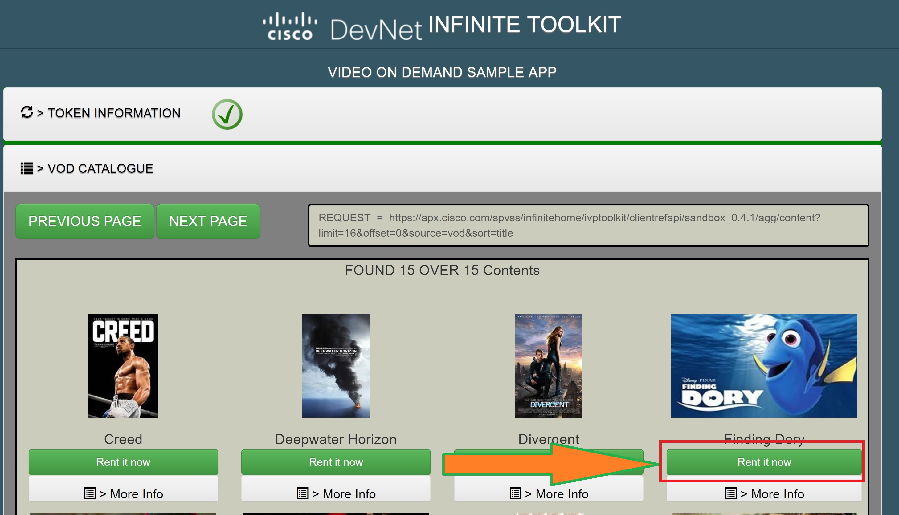
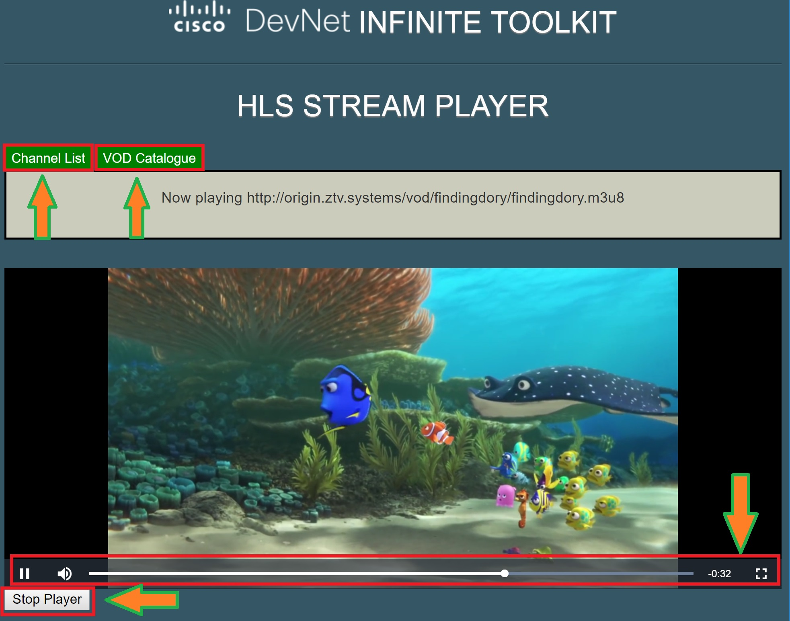

#  How to play video content with REF-API (8/8)

## 8 Use the 'VOD catalogue'  Sample App  (HTML5)

'VOD catalogue' is another sample application also available in the same git repository than Channel List.

### 8.1 Install Sample Apps

This step has already be performed at 6.1.
The URL to use in your browser is:
> **localhost://SampleApps_HTML5/sampleAppsHtml5/vodCatalogue/index.html**
>

### 8.2 Configure Sample App

The **access token** generated at 6.2 is also valid for VOD catalogue application.
No need to configure the Client ID again, this information is store as persistent to be retrieved at next browser session.
But after 1 hour, the token will expire and the user needs to press 'Renew Token' button to get a new one.
> **Remark**:
> At application launch a token refresh procedure is automatically started if expiration date is detected. Be carefull to add the redirect uri of each application using OAuth2 authencation to get an access token. In our case both URI are expected:
- **localhost://SampleApps_HTML5/sampleAppsHtml5/channelList/index.html**
- **localhost://SampleApps_HTML5/sampleAppsHtml5/vodCatalogue/index.html**

### 8.3 Sample App design

- **css** : contains the Change Style Sheet
- **fonts** : contains the special fonts used to display accordion glyph
- **js** : contains the JavaSript functionnal libraries.
- **channelList**: contains HTML page and JavaScript controller for Channel List app.
- **vodCatalogue**: contains HTML page and JavaScript controller for VOD Catalogue app.
- **tokenManager**: contains public tools and token manager

> Note: 
> - 'Channel List' is an example showing **'/channels'** endpoind result.
> - 'VOD Catalogue' is an exmaple showing **'/agg/content'** endpoint result.
> 
### 8.4 Playback screen

When a pressing the 'Rent it now' button, a play session is created and application switch to playback mode.

   

- 2 navigation buttons allow the user to go to '**Channel List**' or '**VOD Catalogue**' applications.
- **Video controls** are provided by the VideoJS plug-in.
- There are similar to those used on YouTube.
- A 'Stop Player' button will call 'Delete play session' command at server side.
> Note: the **delete play session** is also performed when leaving the playback page or exiting the browser.

   

## Conclusion
You have now achieved the second Learning Lab concerning how to play video content using Infinite Toolkit REF-API. Congrats and enjoy writing your own application !
   
