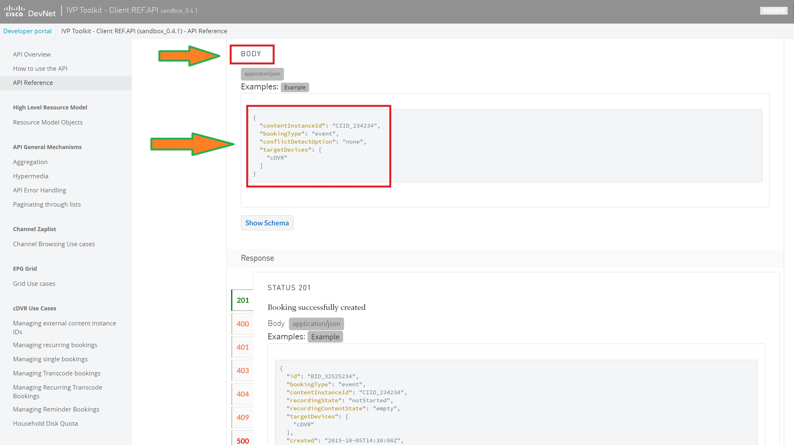

#  Book an event and manage records (4/8)


# 4 - Create a booking

At this stage, you are able to find Live TV events necessary to perform a booking.
Let's check now the query parameters necessary for a POST request on **/agg/library/bookings** endpoint,
Press the '**POST**' button, to access following page:

  <br/>

</br>
> **Remark**: it's important to understand that in case of POST request, the query parameters are added to the body request:


```json
{
  "contentInstanceId": "CIID_234234",
  "bookingType": "event",
  "conflictDetectOption": "none",
  "targetDevices": [
    "cDVR"
  ]
}
```

</br>

  <br/>


When booking creation succeed, it returns a JSON answer which looks like the following:

```json

{
  "id": "BID_32525234",
  "bookingType": "event",
  "contentInstanceId": "CIID_234234",
  "recordingState": "notStarted",
  "recordingContentState": "empty",
  "targetDevices": [
    "cDVR"
  ],
  "created": "2015-10-05T14:30:00Z",
  "lastModified": "2015-10-10T08:11:00Z",
  "_links": {
    "plannerEvent": {
      "href": "/contentInstances/CIID_234234"
    }
  }
}
```


Following booking metadata are provided as part of the answer:
- Booking ID
- Booking Type ("event" for Live TV event)
- Recording State ("notStarted", "inProgress", "Completed" or "Failed")
- Target Devices
- Creation Date
- link to access booking details through **/contentInstances** endpoint.

<br>


