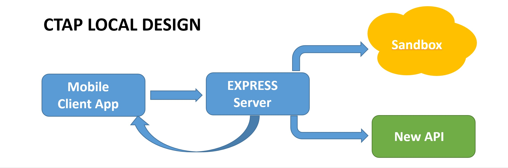

#  Add your own API to existing REF-API (1/6)

## Overview
The REF API is a set of commands provided by ITK allowing a TV client application to access metadata from IVP head-end server about TV channels, VOD assets, manage records and modify user settings.
This API can be easily implemented in various framewok (HTML5, JavaSript, Angular JS, RDK, ...) and target multi-devices (Tablet, smartphone, Laptop, STBs, ...).

> **Note**:
> a more complete presentation of IVP solution is available here:
> https://developer.cisco.com/site/infinite-toolkit/

# 1 Objective

The objective of this labs is to allow an ITK beginner to add its own API to the existing REF-API. It can be done by using a local server redirecting queries to the reference sandbox or to the local server.

   

> **Note**:
> CTAP = Cloud TV Application Platform
>

Completion time: 45 minutes

## Prerequisites
Prior to starting this learning lab it would be necessary to :

- [**Mandatory**] : Achieve first lab 'Start using ITK Sandbox and discover REF-API'
After achieving lab 101, any sandbox user should now be able to use any API defined in REF-API.

- [**Optional**] : Achieve second lab 'Play video content with REF-API'
After achieving lab 102, any sandbox user should now be able to manage play session t and watch video content via HTML5 application running on any browser.

- [**Mandatory**] : REF-API specification,
> This API specification can be found here:
> https://anypoint.mulesoft.com/apiplatform/apx/#/portals

