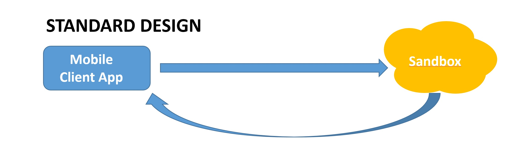

#  Add your own API to existing REF-API (3/6)

# 2 Install the Hello World server

## 2.1 Standard design

The Sandbox allows a client application to access Hean-End resources through the REF-API.

   

 

## 2.2 Add new API
But if for some reason, you want to **add a new API **here is a simple way to achieve that:
- Use a local **Express server** as new root URL
- Route the standard requests to the **sandbox**
- Route the **New API** or modified requests related to the 'new API' stuff to local server.
Local request will be locally handled by specific controlers.

   

The exercise illustrating that Lab consist to add a new category to the VOD store.
This category named '**WISHLIST**' will contain all the events or VOD assets that a user want to keep in a personnal list in order to watch them later.
It means new item can be added to this list and existing items can be removed from the list.

To realize this exercise, it will be necessary to:
- ADD the new node "WISHLIST' to the '/agg/library/category' answer.
- ADD the new item to the "WISHLIST'
- DELETE an existing item from the "WISHLIST'

