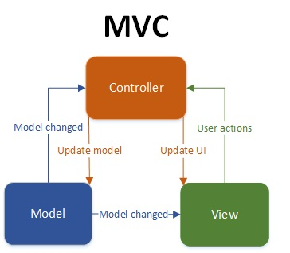

#  Get extended metadata with public API (3/5)

# Step 3 - Modifications done to get extended metadata

### 3.1 Model - View - Controller design

The Angular framework is working with a Model-View-Controller (MVC) design.

   

**Model** : Model means data, that is required to display in the view. It can sometimes be the exact data entities that are retrieved from the business layer or a variation of it. Model encapsulates business tier.

**View** : View is something that displays data to user. In MVC pattern view should be simple and free of business logic implementation. View invokes methods on Controller depending on user actions. In MVC pattern View monitors the model for any state change and displays updated model. Model and View interact with each other using the Observer pattern.

**Controller**: Controller is invoked by view, it executes interacts with the model and performs actions that updates the model. Controller doesn’t have an idea about the changes that it’s updates on the model resulted in the view. Often misunderstood in MVC pattern is the role of Controller. It doesn’t mediate between the view and model,and its not responsible for updating the view. It simply process the user action and updates model, its the view’s job to query and get the status of the changed model and render it.  The only time Controller comes into picture is if a new view has to be rendered.

For each EPG feature,
- The **View** part is handled by HTML page.
- The **Controller** part is handled by JavaScript controller.
- The **Model** is part defined in the JavaScript part as vm.* resource.

