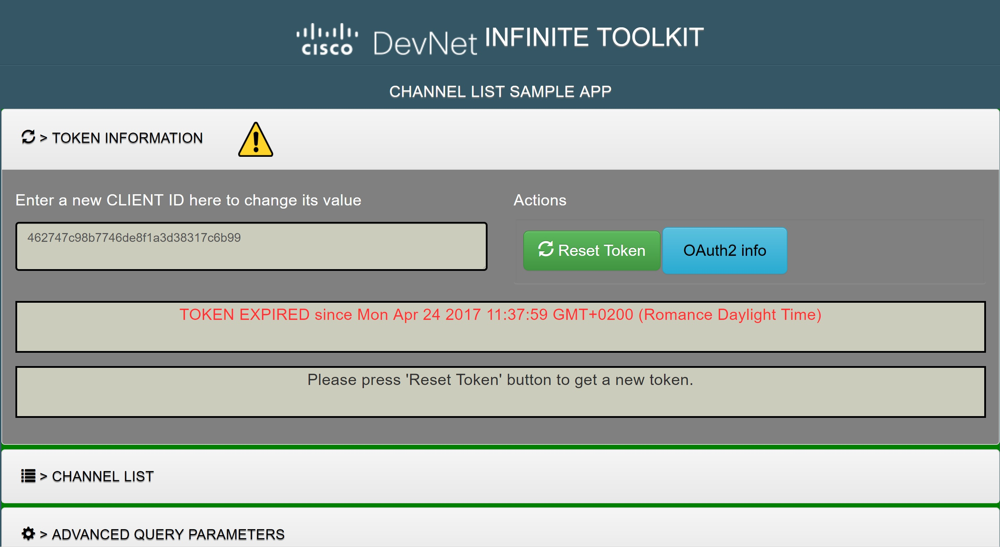
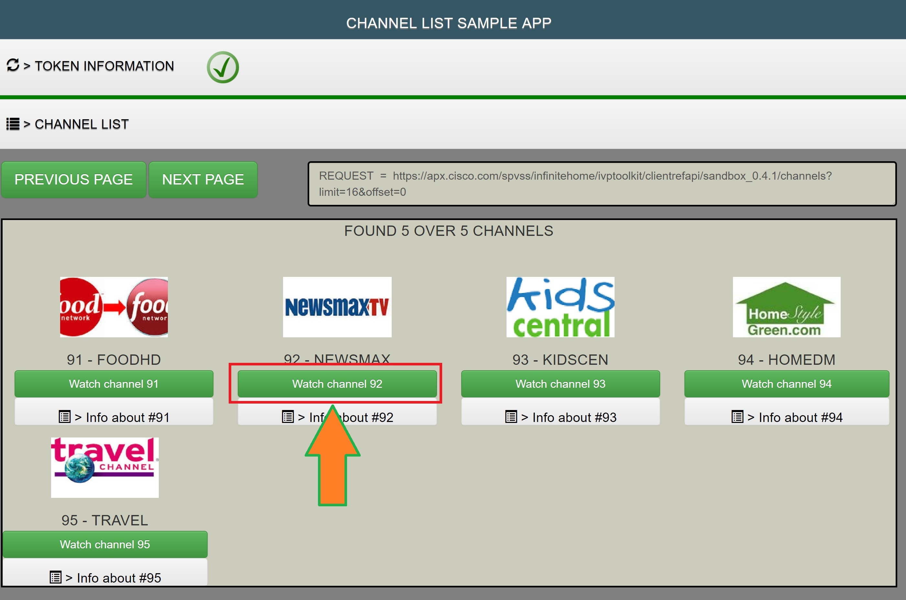
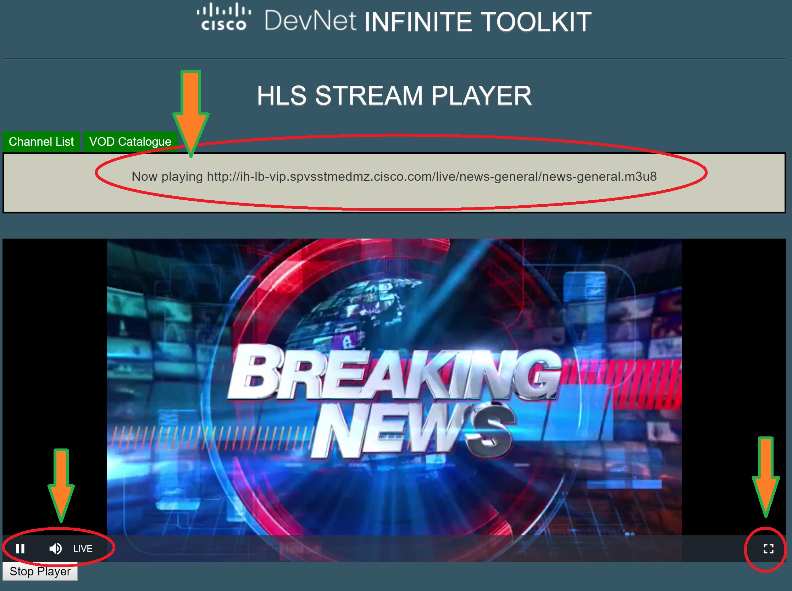

#  How to play video content with REF-API (6/8)

## 6 Use the 'Channel List'  Sample App  (HTML5)

### 6.1 Install  Sample App

1. **Download** the source code file from GIT here: git@github3.cisco.com:InfiniteToolkit/SampleApps_HTML5.git
1. **git clone** it in a local repository
2. **Start a local server** allowing to access source code from '**localhost**'
3. Launch channel list form your browser (I.E., Chrome, Firefox, Safari, ..;)
**localhost/SampleApps_HTML5/sampleAppsHtml5/channelList/index.html**

**TIP**:
If you are only interested by playing with the sample application without modifying the source code,
you can access it here:
> http://sample-apps.spvss-infinitetoolkit.ciscolabs.com/

Creating a **Mulesoft** application to get your own Client ID is necessary with
*redirect_uri=http://sample-apps.spvss-infinitetoolkit.ciscolabs.com
*

### 6.2 Configure Sample App

- Open the **'Token Information**' panel and enter your own Client ID value.
- Press '**RESET TOKEN**' button
- **Channel list** should be visible
If NOT, there is an Access Token issue, better try again '**RESET TOKEN**' button.

   

### 6.3 Sample App design

- **css** : contains the Change Style Sheet
- **fonts** : contains the special fonts used to display accordion glyph
- **js** : contains the JavaSript functionnal libraries.
- **channelList**: contains the HTML sample and the associated controller.
- **tokenManager**: contains public tools and token manager

### 6.4 Playback screen

When a pressing the 'Watch Channel 92' button, a play session is created and application switch to playback mode.

   

The HLS  standard is supported by the **VideoJS** plugin used by our sample app.
> https://github.com/videojs/videojs-contrib-hls
HLS main feature is to provide adaptive bit rate depending on connection bandwidth available at client side.

The video content starts playing in a dedicated almost fullscreen interface.
For current sandbox, video content is available at HLS format (HLS = Http Streaming)

Video controls, similar to those used on YouTube can be performed.

   
