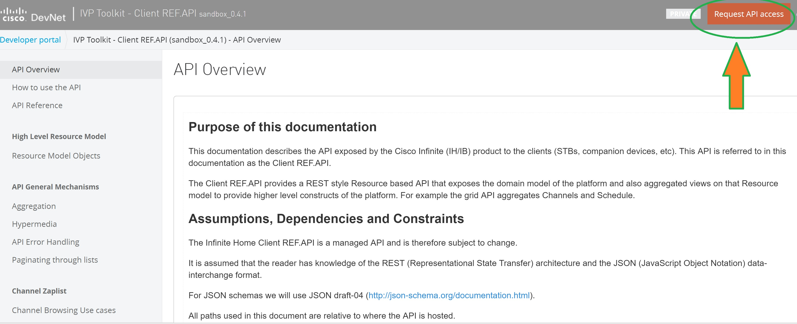
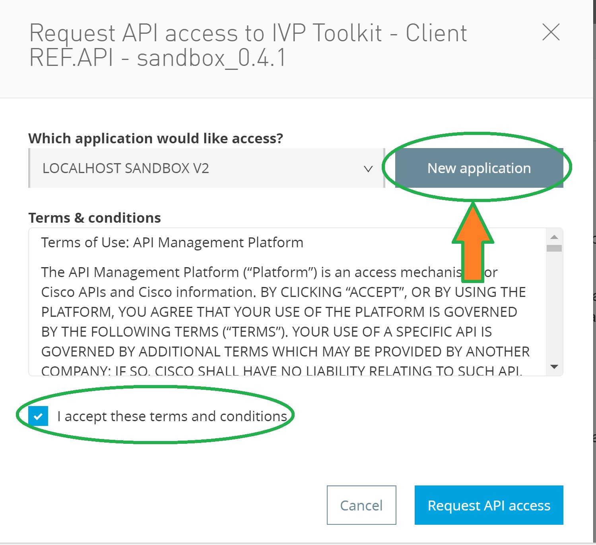
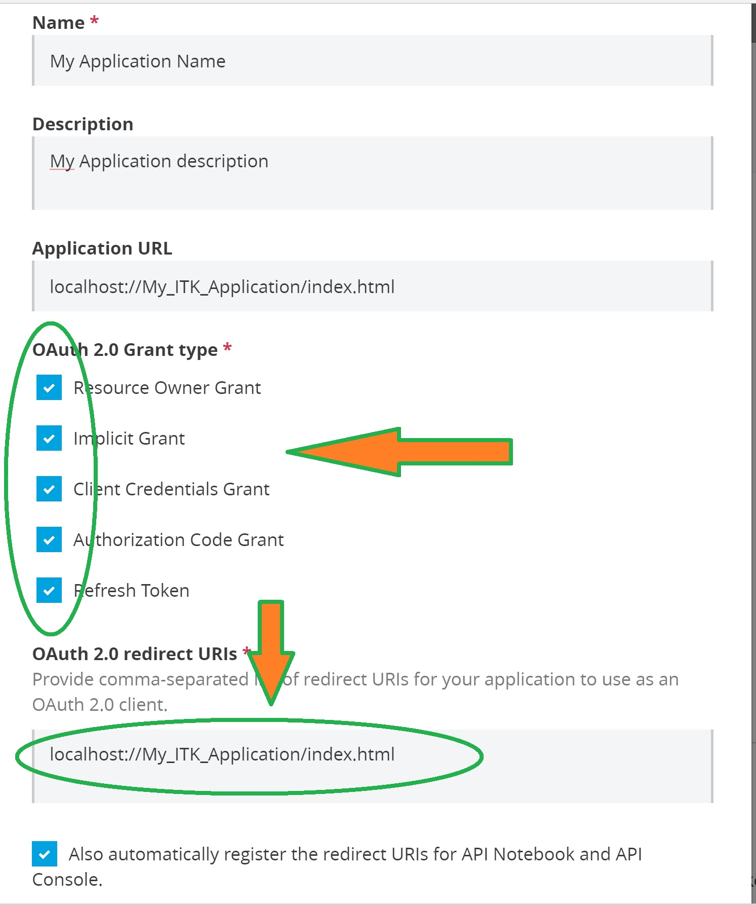
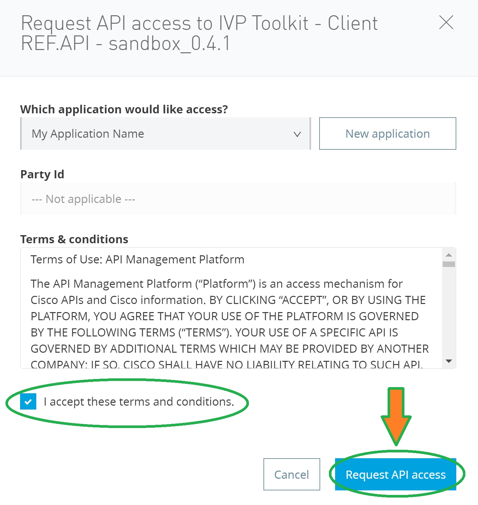
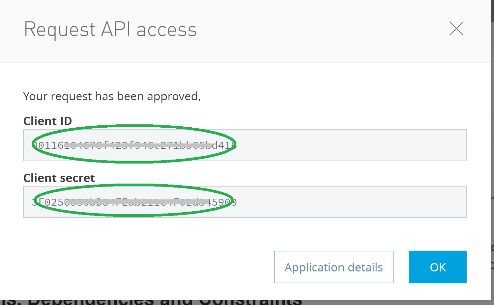

## Register an Application to get Client ID / Secret ID

You have to create a Mulesoft Anypoint application to be able to reach a Sandbox.
Sandbox list is available here: https://anypoint.mulesoft.com/apiplatform/apx/#/portals

By using the keyword 'sandbox', you can find the latest version available:
  <br/><br/>

After selecting your sandbox version, you can create your Mulesoft application by clicking "Request API access" on top of our APIs portals.
  <br/><br/>

The following pop-up allow you to create a new application:
<br/><br/>

In the below example, application name, description and redirect uri must be adapted.
Select all the options and enter carefully the redirect URI of your application,
then press '**ADD**' button:
<br/><br/>

```json
TIP:
For local test, 
use http://localhost/My_ITK_Application instead of localhost://My_ITK_Application
```

Now, Select '**Request API access**' button

<br/><br/>

This will give you the Client ID and a Client Secret  requested to access the REF API.
(You will also receive a confirmation email)
<br/><br/>

```json
TIP:
it's a good idea to copy / paste your new Client ID and Secret 
in a personnal note file to remember it easily.```

